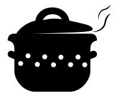
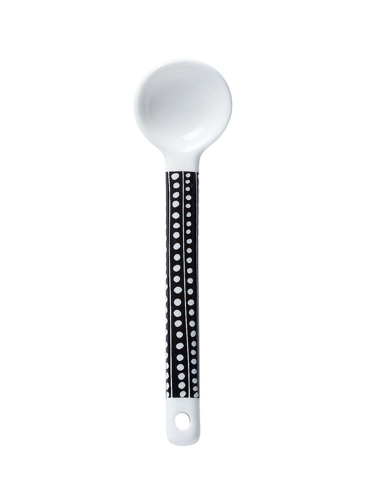

<!Doctype html>
<html lang="en">
<head>
	<meta charset="utf-8">
	<title> Krckaonica </title>
	
	</head>
	<body bgcolor="white">
	

		
		

		<h1 align="center">Krčkaonica 
		
		</h1>
		

		
		
 
			<ul>
  			<li><a href="#home">Home</a></li>
  			<li><a href="#news">News</a></li>
 			 <li><a href="#contact">Contact</a></li>
 			 <li><a href="#about">About</a></li>
			</ul>
			

			

	</body>
</html>
